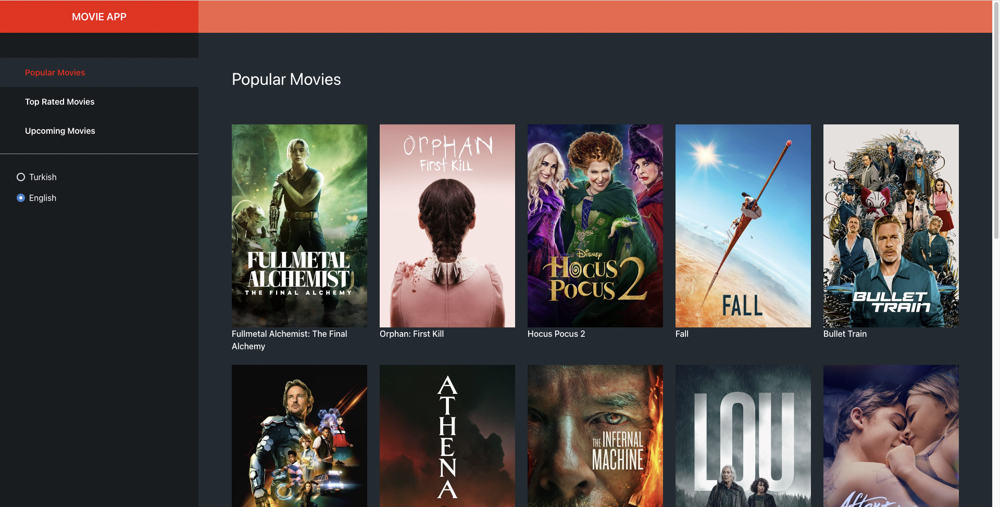
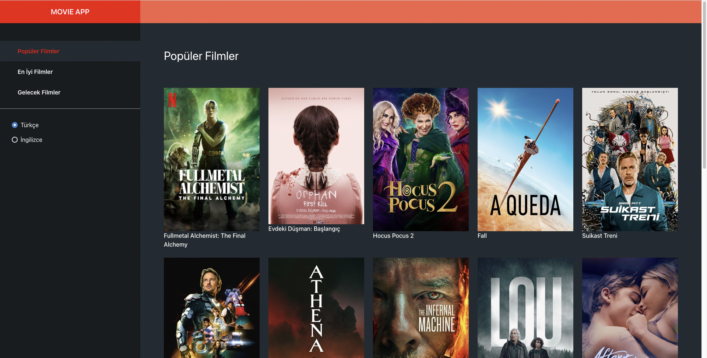
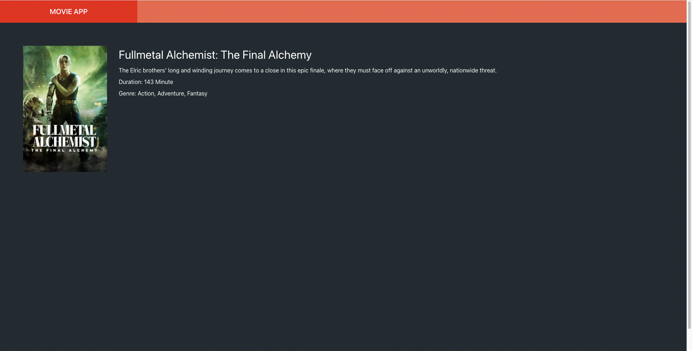

# Albert React Coding Challenge
The goal of this challenge is to give you an opportunity to show us what you know and how you would work in a real life project.

## Requirements
* You should obtain an API Key from the following address: https://developers.themoviedb.org/3 . This key should be stored as an environment variable.
* You will use this Key to create a website with two pages which will display movies
* Your website should support localization (Turkish and English). We advise you to follow Provider Pattern with Custom Hook to handle language all over the app.
* Try to separate business logic from view by following a design pattern like MVVM or MVC

### First Page
* In the first page, you will display list of movies as a grid
* On the left, there should be a menu with the following items: 'Popular Movies', 'Top Rated Movies' and 'Upcoming Movies'. When user clicks a menu item, you should get movies from the right endpoint. Please check the documentation of tMDB API.
* In addition, language can be changed from the menu. When user click Turkish, your website should use Turkish. In addition, you should also use query parameter `language` in your API request to fetch data from API by using the language of your website. In the screenshots below, you can see that movie posters were changed when language is changed.

App when English is selected:

App when Turkish is selected:

### Second Page
* When user clicks a movie in the first page, user will be navigated to a new page to see the movie details.
* This page will contain movie poster, title, overview, genres and duration. You are free to add more details.
* Page of this page should be same a the first page. If user selects Turkish in the first page, everything in this page should be also Turkish.

## Tips
* You can use any UI Library. (Chakra UI is preferred)
* Typescript usage is not mandatory but nice to use.
